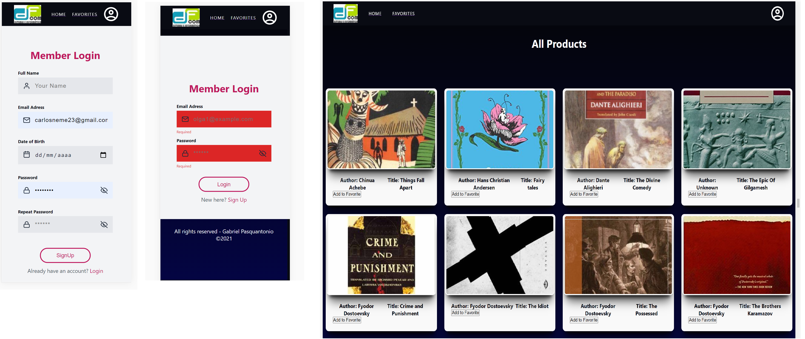

# <div align="center">📋 MERN App</div>
<a href="https://mongodb-70101.web.app/"/>

                             </a>
<p align="center">MERN system that consults a product API and shows the products on the screen, giving the user the possibility to "favorite" a product if is logged in. If the user "favorites" any product, it should appear  listed in the user's favorites.
The system has a login and singup authentication made with formik,Yup libraries from ReactJs and NodeJS. The data is storage in a online mongodb database hosted with heroku.</p>

## 🛠️ Technologies

<ul>
  <li><a href="https://reactjs.org/">React</a></li>
  <li><a href="https://firebase.google.com/?hl=pt-br">Firebase</a></li>
  <li><a href="https://firebase.google.com/?hl=pt-br">MongoDB</a></li>
  <li><a href="https://nodejs.org/en/">NodeJS</a></li>
  <li><a href="https://www.npmjs.com/package/yup">YUP</a></li>
  <li><a href="https://formik.org/docs/overview">Formik</a></li>
</ul>

## ⚙️ Requirements

<ul>
  <li><a href="https://git-scm.com/">Git</a></li>
  <li><a href="https://nodejs.org/en/">Node.js</a></li>
  <li><a href="https://www.npmjs.com/">NPM</a></li>
</ul>

## 🚀 Installation

```
$ git clone https://github.com/gabrielpasquantonio/MERN.git
$ cd MERN-
$ npm install
$ npm start
```

The application will open in the browser on http://localhost:3000
